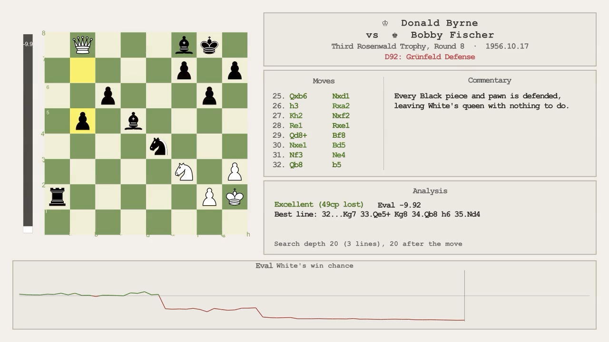

# Chess Game Animator

A Python pipeline that turns a PGN chess game into an annotated video using [Manim](https://www.manim.community/). Each move is animated on a live board alongside a Stockfish evaluation bar, a scrolling move list, a commentary panel, and a four-plot metrics strip showing positional trends across the whole game.



---

## Example Output

Rendered games are on [this YouTube playlist](https://www.youtube.com/watch?v=hScw3EaoxNk&list=PLSwHwWPf_04RVNjMkisroM9gFSEWDFMP4).

Each frame is laid out like this:

```
┌──────────────────────────────────────────────────────────────┐
│ E │              │ Header (players, event, date, opening)    │
│ v │              ├──────────────┬────────────────────────────┤
│ a │  Chess board │ Moves        │ Commentary                 │
│ l │              ├──────────────┴────────────────────────────┤
│   │              │ Analysis (Stockfish)                      │
├──────────────────────────────────────────────────────────────┤
│  Eval win chance  │  Space  │  Mobility  │  King Safety      │
└──────────────────────────────────────────────────────────────┘
```

- **Eval bar:** Stockfish's evaluation, shown as a number, as `M3` for a forced mate, or as `1-0` / `0-1` at checkmate. The fill uses Lichess's win-probability curve, so a big advantage fills most of the bar but only a forced mate fills all of it.
- **Moves:** one row per move number, with White's and Black's moves in aligned columns, scrolling as the game goes on. Each move is colored by quality: greens for good moves, brown for book moves, and amber, orange and red for inaccuracies, mistakes and blunders. Marks such as `?!` or `??` come from the engine, or from the PGN if it has its own (see [Adding Your Own Commentary](#adding-your-own-commentary)).
- **Commentary:** your own notes for the current move, from the PGN or a notes file, beside the move list.
- **Analysis:** Stockfish's view of every move: its rating and the centipawns lost, the evaluation, the best line (up to 6 plies) whenever the move played wasn't rated best, Lichess-style advice when a forced mate appears or is missed, and how deep the search went.
- **Metrics strip:** four plots that extend by one point per move. Eval shows White's win chance from -1 to +1. Space, Mobility and King Safety scale to the range the game actually covers, and that range is printed next to each title.

Each move stays on screen for about 1.6 seconds. A move with a comment stays longer, long enough to read it at about 15 characters a second.

The end card lists the engine and search settings used, e.g. `Stockfish 19 · depth 20 · 3 lines · 1 thread`.

---

## Requirements

| Dependency | Notes |
|---|---|
| Python 3.10+ | |
| [Manim Community](https://www.manim.community/) v0.18+ | Tested with v0.21 |
| [manim-chess](https://github.com/swoyer2/manim-chess) | Provides `Board` and `EvaluationBar` |
| [python-chess](https://python-chess.readthedocs.io/) | Installed as `chess` |
| [Stockfish](https://stockfishchess.org/download/) | Binary on your system |

Install the Python dependencies:

```bash
pip install -r requirements.txt
```

Manim also needs a few system libraries (such as Cairo, Pango and FFmpeg); see [Manim's installation guide](https://docs.manim.community/en/stable/installation.html) for your platform.

---

## File Overview

| File | Purpose |
|---|---|
| `run_animator.py` | **Start here.** CLI entry point — runs analysis and/or Manim. |
| `animator_game.py` | Main Manim scene (`AnimatedGame`). Move loop, panels, metrics. |
| `animator_layout.py` | All geometry constants, colors, and fonts in one place. |
| `animator_initial_frame.py` | Initial frame scene and `GameInfo` dataclass. |
| `animator_metrics.py` | Four-plot metrics strip (Eval, Space, Mobility, King Safety). |
| `chess_game_analyzer.py` | Stockfish wrapper — produces per-move positional metrics. |
| `convert_script_to_comment_dict.py` | Reads commentary from a `[KEY]` notes file and from PGN comments and move marks. |
| `sample_game.pgn` | The annotated example game used throughout this README. |
| `tests/` | Unit tests (see [Testing Without a Game File](#testing-without-a-game-file)). |
| `preview.png` | The screenshot at the top of this README. |
| `manim_chess/` | A modified copy of the manim-chess library. It is **not used**: the pip-installed package is imported instead. |

---

## Quick Start

The repository includes `sample_game.pgn`: Donald Byrne vs. Bobby Fischer, New York 1956, known as "The Game of the Century". The 13-year-old Fischer sacrifices his queen on move 17 and mates on move 41. The PGN carries its own commentary and move marks, which appear in the video (see [Adding Your Own Commentary](#adding-your-own-commentary)). All examples below use this file.

### 1. Analyze and animate in one step

```bash
python run_animator.py sample_game --analyze --depth 20
```

This runs Stockfish at depth 20, saves `sample_game_analysis.json`, then renders a low-quality preview video. The `--analyze` flag is only needed the first time; subsequent renders reuse the saved JSON. While the analysis runs, a progress line shows how many moves are done and an estimate of the time left:

```
Analyzing move 23/82 (28%) · 1:12 elapsed · ~3:05 left
```

When it finishes, it reports how deep the searches actually got:

```
Depth reached (asked for 20): 20 before each move (3 lines); 20 after it (1 line). 1 thread, 256 MB hash.
```

On a slow machine, `--time-limit` stops each Stockfish search after that many seconds even if `--depth` hasn't been reached, which keeps deep analysis to a predictable time. The depth is then a maximum: with `--depth 30 --time-limit 0.2`, a 4-core laptop reached only depth 13–18. The summary above and the per-move depth in the Analysis panel show what you actually got.

```bash
python run_animator.py sample_game --analyze --depth 24 --time-limit 2
```

#### Threads and memory

Stockfish gets a 256 MB hash table (its own default is 16 MB); change it with `--hash MB`. The number of CPU threads depends on the kind of search, and `--threads N` overrides it:

- **Depth only (no `--time-limit`): 1 thread.** At a fixed depth, extra threads widen the search instead of reaching the depth sooner. On a 4-core Ryzen laptop, one depth-20 position took 1.7 s with 1 thread and 53 s with 7. One thread also gives the same result on every run.
- **With `--time-limit`: all cores but one.** Here the time is fixed, and 7 threads searched about 3.7 times as many positions as 1 in the same time, which gives a stronger answer.

### 2. Re-render without re-analyzing

```bash
python run_animator.py sample_game
```

Changes to the PGN's headers (players, event, date, opening) and commentary show up without re-analyzing; only a change to the moves needs `--analyze` again.

### 3. Quality and resolution

Manim's quality flag controls both resolution and frame rate together:

| Flag | Resolution | FPS | Use case |
|---|---|---|---|
| `--quality low` | 854 × 480 | 15 | Fast preview during development |
| `--quality medium` | 1280 × 720 | 30 | Draft review |
| `--quality high` | 1920 × 1080 | 60 | Final YouTube/Vimeo upload |
| `--quality ultra` | 3840 × 2160 | 60 | 4K archival render |

```bash
# Fast preview (default)
python run_animator.py sample_game --quality low

# 1080p final render, no auto-open
python run_animator.py sample_game --quality high --no-preview

# 4K archival render (slow — allow 30–60 min on a typical machine)
python run_animator.py sample_game --quality ultra --no-preview
```

### 4. Stockfish location

```bash
python run_animator.py sample_game --analyze --depth 22 \
    --stockfish /opt/homebrew/bin/stockfish
```

By default Stockfish is found automatically in this order: the `STOCKFISH_PATH` environment variable if set, then `stockfish` on your `PATH`, then any `stockfish*` executable on your `PATH` (so official release names like `stockfish-ubuntu-x86-64-avx2` work unrenamed). If Stockfish isn't on your `PATH`, set `STOCKFISH_PATH` or pass `--stockfish`.

### 5. Your own game

Replace `sample_game` with any base filename, optionally with a folder. The script looks for `{name}.pgn`, `{name}_analysis.json`, and optionally `{name}_notes.txt`:

```bash
python run_animator.py my_game --analyze --depth 20
python run_animator.py games/my_game --analyze --depth 20
```

---

## Adding Your Own Commentary

There are two ways to add commentary, and you can use both.

### In the PGN

Comments in curly braces after a move are shown in the commentary panel when that move is played. A comment before the first move is shown on the title card. Move marks (`!`, `?`, `!!`, `??`, `!?`, `?!`) replace the engine's symbol for that move in the move list:

```
{Fischer, aged 13, against one of America's leading masters.}
1. Nf3 Nf6 2. c4 g6 ... 11. Bg5? {Moving the same piece twice.} 11... Na4!!
```

Only the main line is read; side variations are ignored. Clock and eval tags from Lichess or Chess.com exports, such as `[%clk 0:03:00]`, are ignored too, so downloaded games work as-is.

### In a notes file

Create a plain text file named `{game_id}_notes.txt` next to the PGN, e.g. `sample_game_notes.txt`. Each entry is a ply number in square brackets, where ply 1 is White's first move, ply 2 is Black's first move, and so on, followed by your comment. Three other keys are recognised: `[INTRO]` is shown on the title card, and `[RESULT]` and `[CONCLUSION]` on the end card.

```
[INTRO]
The Game of the Century, New York 1956.

[21] Byrne moves the same bishop twice instead of castling.

[34] Fischer leaves his queen en prise. If 18.Bxb6, a windmill of checks follows.

[CONCLUSION]
A 13-year-old's masterpiece.
```

If the notes file and the PGN both have a comment for the same move, the notes file wins.

Comments appear in the Commentary column beside the move list, word-wrapped to fit its 7 lines of about 44 characters. A comment that wraps to more lines is cut off, and the render prints a warning naming the move. The video holds a commented move long enough to read it.

Stockfish's analysis has its own panel, so it is shown for every move whether or not you've commented on it. Moves that create, lose, or delay a forced mate get Lichess-style mate advice there, with the mating line the mover had, e.g. `Lost forced checkmate sequence. Mate in 2: Kg6 Kg8 Qb8#`.

---

## How the Analysis Works

`chess_game_analyzer.py` runs Stockfish on each position and also computes four positional metrics directly from the board using `python-chess`:

| Metric | What it measures |
|---|---|
| **Eval** | Stockfish evaluation, plotted as White's win-probability advantage in [-1, +1] (0 cp → 0, ±300 cp → ±0.5, forced mate → ±1) |
| **Space** | Control of central territory, weighted by piece count behind the pawn chain |
| **Mobility** | Legal moves per piece type, weighted and penalized for unsafe squares |
| **King Safety** | Pawn shield strength, king tropism, and attack units near the king |

The Eval plot uses a fixed scale, so large evals and forced mates bend toward the edge instead of being clipped. The other three plots auto-scale to the actual range of values in the game (with 15% padding) so variation is always visible regardless of the absolute values. The range is shown next to each plot title, e.g. `King Safety [-0.22, 1.7]`.

### Move classification

Moves are judged by how much they drop the mover's **winning chances** (Lichess's centipawn → win-chance curve, on a -1 to +1 scale) rather than by raw centipawn loss, so losing a pawn at +8 costs far less than losing one at 0:

| Classification | Rule |
|---|---|
| Book | Ply ≤ 12 and < 30 cp lost |
| Best | < 5 cp lost |
| Excellent | Win-chance drop < 0.04 |
| Good | < 0.10 |
| Inaccuracy | < 0.20 |
| Mistake | < 0.30 |
| Blunder | ≥ 0.30 |

Forced mates follow Lichess's rules, which override the table above:

- **Checkmate is now unavoidable** (walked into a forced mate): blunder, or mistake / inaccuracy if the mover was already losing badly (below -7 / -10 pawns).
- **Lost forced checkmate sequence** (had a forced mate, no longer does): blunder, or mistake / inaccuracy if still winning big (above +7 / +10 pawns).
- **Not the best checkmate sequence** (still mates, but more slowly): excellent.

The thresholds are constants near the top of `chess_game_analyzer.py` (`WIN_DROP_*`, `MATE_*`).

### Best lines and search depth

Before each move, Stockfish searches the position for its 3 best lines (MultiPV 3). The best line becomes the "best line" shown in the Analysis panel, and the other two are kept as playable alternatives. After the move, one line is searched for the evaluation. For every move, the analysis file records:

| Field | Meaning |
|---|---|
| `best_line` | Stockfish's best line from the position before the move, in SAN (up to 12 plies) |
| `search_depth` | Depth reached by the search before the move |
| `search_lines` | Lines that search returned (3, or fewer when fewer moves are legal) |
| `search_depth_after` | Depth reached by the search after the move |

The file's `engine` section records the engine name, requested depth, time limit, lines, threads and hash size.

### LaTeX reports

`chess_game_analyzer.py` also runs on its own and writes a LaTeX report of a game, with diagrams, plots and the same move classifications and mate advice. Compiling the report needs a LaTeX distribution; the videos don't.

```bash
python chess_game_analyzer.py sample_game.pgn -o sample_game_report.tex
python chess_game_analyzer.py --help   # all options
```

---

## Testing Without a Game File

A `QuickDemo` scene is included that runs without any PGN or analysis file:

```bash
python run_animator.py --scene QuickDemo
# or directly:
manim -pql animator_game.py QuickDemo
```

The metrics strip can also be tested independently with synthetic sine-wave data:

```bash
manim -pql animator_metrics.py MetricsDebug
```

The unit tests use the standard library's `unittest`. A few are skipped if Stockfish isn't on your `PATH`:

```bash
python -m unittest discover tests
```

---

## Customization

### Changing the eval bar sensitivity

The eval bar maps centipawns to fill with a logistic curve, `1 / (1 + e^(-k·cp))`. To change how quickly it fills, edit `ScaledEvaluationBar._SIGMOID_K` in `animator_game.py`:

```python
_SIGMOID_K = 0.00368208  # Lichess coefficient: +100 cp ≈ 59%, +400 cp ≈ 81%, +1000 cp ≈ 98%
```

A larger `k` fills the bar faster. The Eval plot has its own copy of this coefficient (`_EVAL_WIN_K` in `animator_metrics.py`), and move classification uses `WIN_CHANCES_K` in `chess_game_analyzer.py`; keep them in step if you want the bar, plot, and classifications to agree.

### Swapping the fourth metrics plot

The fourth plot is King Safety. To swap it for Threats (or FTI), edit the `_ks_w` / `_ks_b` extraction in `MetricPlotPanel.__init__` in `animator_metrics.py` and the corresponding `advance_to_move()` call. The fields available on each `MoveData` are: `space_white/black`, `mobility_white/black`, `king_safety_white/black`, `threats_white/black`, `fti1`, `fti2`, `fti3`.

### Colors and fonts

All colors and font sizes are in `animator_layout.py` — `ColorScheme` and `Typography` dataclasses at the top of the file.

---

## Data Flow

```
sample_game.pgn                    moves, headers, commentary, move marks
    │
    ▼
chess_game_analyzer.py             (--analyze, run once per game)
    │
    ▼
sample_game_analysis.json          per-move evals, classifications, metrics

sample_game_notes.txt              (optional, hand-written commentary)

run_animator.py
    ├── writes sample_game_animator_config.json
    ├── sets CHESS_ANIMATOR_CONFIG environment variable
    └── calls: manim -pql animator_game.py AnimatedGame

AnimatedGame.construct()
    ├── loads analysis JSON  →  List[MoveData]
    ├── reads headers, comments and move marks from the PGN,
    │   then the notes file (which wins for the same move)
    ├── builds board, eval bar, header, move list, commentary, metrics strip
    └── for each move:
            move the piece
            update eval bar, move list, commentary and analysis together
            hold longer if the move has a comment
            reveal next metrics segment
```

---

## License

MIT License. See [`LICENSE.txt`](LICENSE.txt) for details.

---

## Author

David Joyner
