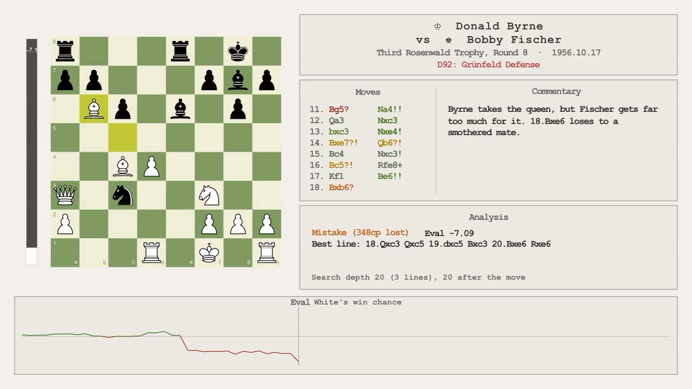

# Chess Game Animator

A Python pipeline that turns a PGN chess game into an annotated video using [Manim](https://www.manim.community/). Each move is animated on a live board alongside a Stockfish evaluation bar, a scrolling move list, your commentary, Stockfish's analysis of each move, and a plot of the evaluation across the whole game.



---

## Example Output

Each frame is laid out like this:

```
┌──────────────────────────────────────────────────────────────┐
│ E │              │ Header (players, event, date, opening)    │
│ v │              ├──────────────┬────────────────────────────┤
│ a │  Chess board │ Moves        │ Commentary                 │
│ l │              ├──────────────┴────────────────────────────┤
│   │              │ Analysis (Stockfish)                      │
├──────────────────────────────────────────────────────────────┤
│  Eval: White's win chance over the whole game                │
└──────────────────────────────────────────────────────────────┘
```

- **Board:** the last move's mark (`!!`, `!`, `!?`, `?!`, `?`, `??`) shown the way [en-croissant](https://github.com/franciscoBSalgueiro/en-croissant) shows it: the move's two squares are tinted in the mark's colour, and a round badge with the symbol sits on the destination square's corner.
- **Eval bar:** Stockfish's evaluation, shown as a number, as `M3` for a forced mate, or as `1-0` / `0-1` at checkmate. The fill uses Lichess's win-probability curve, so a big advantage fills most of the bar but only a forced mate fills all of it.
- **Moves:** one row per move number, with White's and Black's moves in aligned columns, scrolling as the game goes on. Each move is colored by its rating: green for Stockfish's best move, black for a move with no rating, and amber, orange and red for inaccuracies, mistakes and blunders. Marks such as `?!` or `??` come from the engine, or from the PGN if it has its own (see [Adding Your Own Commentary](#adding-your-own-commentary)).
- **Commentary:** your own notes for the current move, from the PGN or a notes file, beside the move list.
- **Analysis:** the opening while the move is still in book (see [Opening names](#opening-names)), then Stockfish's view of every move: its rating and the centipawns lost, the evaluation, the best line (up to 6 plies) whenever the move played wasn't rated best, Lichess-style advice when a forced mate appears or is missed, and how deep the search went.
- **Eval plot:** Stockfish's evaluation as White's win chance from -1 to +1, starting from the starting position and extending by one point per ply across the full width of the frame. Green while White is better, red while Black is; a line that crosses zero changes colour where it crosses.

Each ply (one side's move) stays on screen for about 1.6 seconds. A ply with a comment stays longer, long enough to read it at about 15 characters a second.

The end card lists the engine and search settings used, e.g. `Stockfish 19 · depth 14–245 · 4s per position · 1 line · 7 threads` (the range is the depth the searches reached).

---

## Requirements

| Dependency | Notes |
|---|---|
| Python 3.10+ | |
| [manim](https://github.com/ManimCommunity/manim) by [Manim Community](https://www.manim.community/) v0.18+ | Tested with v0.21 |
| [manim-chess](https://github.com/swoyer2/manim_chess) | Provides `Board` and `EvaluationBar` |
| [python-chess](https://python-chess.readthedocs.io/) | Installed as `chess` |
| [Stockfish](https://stockfishchess.org/download/) | Binary on your system |

Install the Python dependencies in a virtual environment:

```bash
python -m venv .venv
source .venv/bin/activate   # Windows: .venv\Scripts\activate
pip install -r requirements.txt
```

Manim also needs a few system libraries (such as Cairo, Pango and FFmpeg); see [Manim's installation guide](https://docs.manim.community/en/stable/installation.html) for your platform.

---

## File Overview

| File | Purpose |
|---|---|
| `run_animator.py` | **Start here.** CLI entry point — runs analysis and/or Manim. |
| `animator_game.py` | Main Manim scene (`AnimatedGame`). Move loop and panels. |
| `animator_layout.py` | All geometry constants, colors, and fonts in one place. |
| `animator_initial_frame.py` | Initial frame scene and `GameInfo` dataclass. |
| `animator_metrics.py` | The Eval plot along the bottom of the frame. |
| `chess_game_analyzer.py` | Stockfish wrapper: per-move evals, ratings, best lines and mate advice; also writes LaTeX reports. |
| `chess_openings.py` | Names the opening and marks book moves, from the Lichess opening data in `openings/`. |
| `openings/` | Lichess's opening data (`a.tsv` to `e.tsv`). |
| `upstream_fixes.py` | Patches for bugs in manim and manim-chess, applied when the scenes import it; each is reported upstream. |
| `convert_script_to_comment_dict.py` | Reads commentary from a `[KEY]` notes file and from PGN comments and move marks. |
| `sample_game.pgn` | The annotated example game used throughout this README. |
| `tests/` | Unit tests (see [Testing Without a Game File](#testing-without-a-game-file)). |
| `preview.png` | The screenshot at the top of this README. |

---

## Quick Start

The repository includes `sample_game.pgn`: Donald Byrne vs. Bobby Fischer, New York 1956, known as "The Game of the Century". The 13-year-old Fischer sacrifices his queen on move 17 and mates on move 41. The PGN carries its own commentary and move marks, which appear in the video (see [Adding Your Own Commentary](#adding-your-own-commentary)). All examples below use this file.

### 1. Analyze and animate in one step

```bash
python run_animator.py sample_game --analyze
```

This gives Stockfish 4 seconds for each position, saves `sample_game_analysis.json`, then renders a 720p video (the analysis took 4 minutes 50 seconds for the sample game's 82 plies on a 4-core laptop). The `--analyze` flag is only needed the first time; subsequent renders reuse the saved JSON. While the analysis runs, a progress line shows how many moves are done and an estimate of the time left:

```
Analyzing ply 23/82 (28%) · 1:12 elapsed · ~3:05 left
```

When it finishes, it reports how deep the searches actually got:

```
Depth reached (4s per position): 14–245, median 26, before each move, 14–245, median 26, after it (1 line). 7 threads, 256 MB hash.
```

(245 is Stockfish's maximum depth, which it reports once it has found a forced mate.)

Each search goes as deep as its time allows, so simple positions (often in the endgame) are searched far deeper than complicated ones. `--time-limit` changes the time; `--depth` searches to a set depth instead:

```bash
python run_animator.py sample_game --analyze --time-limit 10   # more time per position
python run_animator.py sample_game --analyze --depth 20        # the same result on every run
```

A search for a set time can come out slightly differently on each run (on the sample game, two runs gave different ratings for 9 of 82 plies, mostly moves near a rating threshold), and on a slower machine it gets less deep. A depth alone, on 1 thread, gives the same analysis every time. With both `--depth` and `--time-limit`, each search stops at whichever comes first. The summary above and the per-move depth in the Analysis panel show what you actually got.

Why 4 seconds and 1 line: compared with 30-second searches of 16 positions from the sample game, 4 s per position had a mean eval error of 40–46 cp, depth 20 with 3 lines (the previous default) 101 cp, and depth 26 with 1 line 80 cp, which also took longer (7 minutes).

#### Threads and memory

Stockfish gets a 256 MB hash table (its own default is 16 MB); change it with `--hash MB`. The number of CPU threads depends on the kind of search, and `--threads N` overrides it:

- **With a time limit (the default): all cores but one.** Here the time is fixed, and 7 threads searched about 3.7 times as many positions as 1 in the same time, which gives a stronger answer.
- **Depth only (`--depth` without `--time-limit`): 1 thread.** At a fixed depth, extra threads widen the search instead of reaching the depth sooner. On a 4-core Ryzen laptop, one depth-20 position took 1.7 s with 1 thread and 53 s with 7. One thread also gives the same result on every run.

`--lines N` sets how many lines Stockfish searches in each position (default 1). The video only shows the best line, and extra lines weaken a multi-threaded search badly: in 5 seconds, 7 threads reached depth 33–35 with 1 line but only 13–33 with 3.

### 2. Re-render without re-analyzing

```bash
python run_animator.py sample_game
```

Changes to the PGN's headers (players, event, date, opening) and commentary show up without re-analyzing; only a change to the moves needs `--analyze` again.

### 3. Quality and resolution

Manim's quality flag controls both resolution and frame rate together:

| Flag | Resolution | FPS | Use case |
|---|---|---|---|
| `--quality low` | 854 × 480 | 15 | Fast preview; small text is hard to read |
| `--quality medium` | 1280 × 720 | 30 | Default |
| `--quality high` | 1920 × 1080 | 60 | Final YouTube/Vimeo upload |
| `--quality ultra` | 3840 × 2160 | 60 | 4K archival render |

```bash
# Fast preview at 480p
python run_animator.py sample_game --quality low

# 1080p final render, no auto-open
python run_animator.py sample_game --quality high --no-preview

# 4K archival render (slow — allow 30–60 min on a typical machine)
python run_animator.py sample_game --quality ultra --no-preview
```

### 4. Stockfish location

```bash
python run_animator.py sample_game --analyze \
    --stockfish /opt/homebrew/bin/stockfish
```

By default Stockfish is found automatically in this order: the `STOCKFISH_PATH` environment variable if set, then `stockfish` on your `PATH`, then any `stockfish*` executable on your `PATH` (so official release names like `stockfish-ubuntu-x86-64-avx2` work unrenamed). If Stockfish isn't on your `PATH`, set `STOCKFISH_PATH` or pass `--stockfish`.

### 5. Your own game

Replace `sample_game` with any base filename, optionally with a folder. The script looks for `{name}.pgn`, `{name}_analysis.json`, and optionally `{name}_notes.txt`:

```bash
python run_animator.py my_game --analyze
python run_animator.py games/my_game --analyze
```

---

## Adding Your Own Commentary

There are two ways to add commentary, and you can use both.

### In the PGN

Comments in curly braces after a move are shown in the commentary panel when that move is played. A comment before the first move is shown on the title card. Move marks (`!`, `?`, `!!`, `??`, `!?`, `?!`) replace the engine's symbol for that move in the move list and on the board:

```
{Fischer, aged 13, against one of America's leading masters.}
1. Nf3 Nf6 2. c4 g6 ... 11. Bg5? {Moving the same piece twice.} 11... Na4!!
```

Only the main line is read; side variations are ignored. Clock and eval tags from Lichess or Chess.com exports, such as `[%clk 0:03:00]`, are ignored too, so downloaded games work as-is.

### In a notes file

Create a plain text file named `{game_id}_notes.txt` next to the PGN, e.g. `sample_game_notes.txt`. Each entry is a ply number in square brackets, where ply 1 is White's first move, ply 2 is Black's first move, and so on, followed by your comment. Three other keys are recognised: `[INTRO]` is shown on the title card, and `[RESULT]` and `[CONCLUSION]` on the end card. Each key goes at the start of a line, and its comment runs until the next key, so a comment can span several lines and contain square brackets.

```
[INTRO]
The Game of the Century, New York 1956.

[21] Byrne moves the same bishop twice instead of castling.

[34] Fischer leaves his queen en prise. If 18.Bxb6, a windmill of checks follows.

[CONCLUSION]
A 13-year-old's masterpiece.
```

If the notes file and the PGN both have a comment for the same move, the notes file wins.

Comments appear in the Commentary column beside the move list, word-wrapped to fit its 7 lines of about 44 characters. A comment that wraps to more lines is cut off, and the render prints a warning naming the ply. The video holds a commented move long enough to read it.

Stockfish's analysis has its own panel, so it is shown for every move whether or not you've commented on it. Moves that create, lose, or delay a forced mate get Lichess-style mate advice there, with the mating line the mover had, e.g. `Lost forced checkmate sequence. Mate in 2: Kg6 Kg8 Qb8#`.

---

## How the Analysis Works

`chess_game_analyzer.py` runs Stockfish on the position before and after each move. Everything the video shows about a move comes from those searches (the evaluation, the rating, the best line and the mate advice), except the opening name.

The Eval plot shows the evaluation as White's win-probability advantage in [-1, +1], using Lichess's curve (0 cp → 0, ±300 cp → ±0.5, forced mate → ±1). That fixed scale lets large evals and forced mates bend toward the edge instead of being clipped.

### Move classification

Moves are judged by how much they drop the mover's **winning chances** (Lichess's centipawn → win-chance curve, on a -1 to +1 scale) rather than by raw centipawn loss, so losing a pawn at +8 costs far less than losing one at 0:

| Classification | Rule |
|---|---|
| Best | Stockfish's own move, or < 5 cp lost |
| *(no rating)* | Win-chance drop < 0.10 |
| Inaccuracy | Win-chance drop < 0.20 |
| Mistake | Win-chance drop < 0.30 |
| Blunder | Win-chance drop ≥ 0.30 |

As in Lichess and en-croissant, a move that is neither the engine's choice nor an inaccuracy gets no rating: the two searches behind a rating (before and after the move) differ by a few centipawns even for the engine's own move, so finer grades such as "excellent" or "good" would mostly measure that noise.

Forced mates follow Lichess's rules, which override the table above:

- **Checkmate is now unavoidable** (walked into a forced mate): blunder, or mistake / inaccuracy if the mover was already losing badly (below -7 / -10 pawns).
- **Lost forced checkmate sequence** (had a forced mate, no longer does): blunder, or mistake / inaccuracy if still winning big (above +7 / +10 pawns).
- **Not the best checkmate sequence** (still mates, but more slowly): no rating, only the advice.

The thresholds are constants near the top of `chess_game_analyzer.py` (`BEST_MAX_LOSS_CP`, `WIN_DROP_*`, `MATE_INACCURACY_CP`, `MATE_MISTAKE_CP`).

### Best lines and search depth

Stockfish searches each position once, for its best lines: 1 by default for the video, set with `--lines` (the LaTeX report searches 3). Before a move, the first line becomes the "best line" shown in the Analysis panel, and any others are kept as playable alternatives for the report; after the move, the next position's search gives the evaluation. For every move, the analysis file records:

| Field | Meaning |
|---|---|
| `best_line` | Stockfish's best line from the position before the move, in SAN (up to 12 plies) |
| `search_depth` | Depth reached by the search before the move |
| `search_lines` | Lines that search returned (as many as `--lines`, or fewer when fewer moves are legal) |
| `search_depth_after` | Depth reached by the search after the move |

The file's `engine` section records the engine name, requested depth (`null` for a search by time only), time limit, lines, threads and hash size.

### Opening names

The opening comes from Lichess's [chess-openings](https://github.com/lichess-org/chess-openings) data (about 3,800 named lines, public domain), copied into `openings/*.tsv`. Openings are classified by the position reached, not the move order, so a game that transposes into a line gets that line's name.

- A move is **in book** when the position after it lies on one of those lines. The Analysis panel then shows `Book:` and the position's opening. The name is not a rating: Stockfish still rates every book move.
- Most positions on a line aren't named themselves. They take the name of the last named position before them on their line, even when the game's own move order skipped that position. If a position is on several lines, the name closest to it wins (ties go to the first line in the data).
- The header and title card show the PGN's `ECO` and `Opening` headers. When the PGN has no `Opening` header, they show the opening of the game's last position in book.

In the sample game, 1.Nf3 Nf6 2.c4 g6 3.Nc3 Bg7 4.d4 O-O 5.Bf4 d5 never passes through a named Grünfeld position, but 5...d5 reaches a position on the line 1.d4 Nf6 2.c4 g6 3.Nc3 d5 4.Nf3 Bg7 5.Bf4 O-O, one ply after the Hungarian Attack. So it's shown as `Grünfeld Defense: Three Knights Variation, Hungarian Attack` (D92). The opening is worked out when the video is rendered, so updating `openings/` doesn't need `--analyze` again.

### LaTeX reports

`chess_game_analyzer.py` also runs on its own and writes a LaTeX report of a game: player statistics, the annotated game with the same move classifications and mate advice, and diagrams of critical positions. `--book` writes one chapter per game for every game in a PGN. Compiling the report needs a LaTeX distribution; the videos don't.

```bash
python chess_game_analyzer.py sample_game.pgn -o sample_game_report.tex
python chess_game_analyzer.py --help   # all options
```

---

## Testing Without a Game File

A `QuickDemo` scene is included that runs without any PGN or analysis file:

```bash
python run_animator.py --scene QuickDemo
# or directly:
manim -pql animator_game.py QuickDemo
```

The Eval plot can also be tested independently with a synthetic evaluation:

```bash
manim -pql animator_metrics.py MetricsDebug
```

The unit tests use the standard library's `unittest`. A few are skipped if Stockfish isn't on your `PATH`:

```bash
python -m unittest discover tests
```

---

## Customization

### Changing the eval bar sensitivity

The eval bar maps centipawns to fill with a logistic curve, `1 / (1 + e^(-k·cp))`. To change how quickly it fills, edit `ScaledEvaluationBar._SIGMOID_K` in `animator_game.py`:

```python
_SIGMOID_K = 0.00368208  # Lichess coefficient: +100 cp ≈ 59%, +400 cp ≈ 81%, +1000 cp ≈ 98%
```

A larger `k` fills the bar faster. The Eval plot and move classification share another copy, `WIN_CHANCES_K` in `chess_game_analyzer.py`; keep the two in step if you want the bar to agree with them.

### Colors and fonts

All colors and font sizes are in `animator_layout.py`: the `ColorScheme` and `Typography` dataclasses, and `ANNOTATION_COLORS` for the move marks on the board.

---

## Data Flow

```
sample_game.pgn                    moves, headers, commentary, move marks
    │
    ▼
chess_game_analyzer.py             (--analyze, run once per game)
    │
    ▼
sample_game_analysis.json          per-move evals, ratings, best lines, depth

sample_game_notes.txt              (optional, hand-written commentary)

run_animator.py
    ├── writes sample_game_animator_config.json
    ├── sets CHESS_ANIMATOR_CONFIG environment variable
    └── calls: manim -pqm animator_game.py AnimatedGame

AnimatedGame.construct()
    ├── loads analysis JSON  →  List[MoveData]
    ├── names the opening and book moves from openings/*.tsv
    ├── reads headers, comments and move marks from the PGN,
    │   then the notes file (which wins for the same move)
    ├── builds board, eval bar, header, move list, commentary, analysis, eval plot
    └── for each ply:
            move the piece and mark it on the board
            update eval bar, move list, commentary and analysis together
            extend the eval plot by one point
            hold longer if the ply has a comment
```

---

## License

MIT License. See [`LICENSE.txt`](LICENSE.txt) for details.

---

## Author

David Joyner
